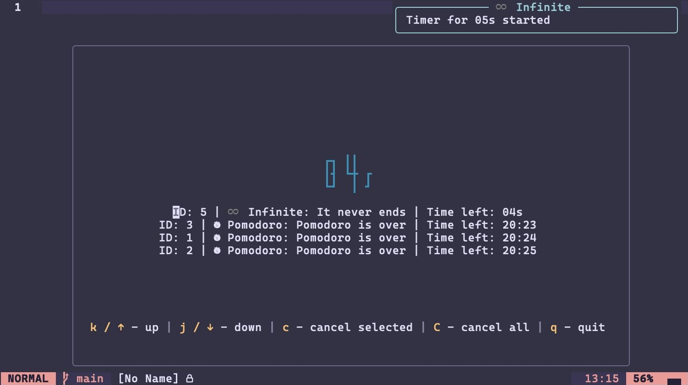

# timers.nvim

`timers.nvim` is a simple timer management plugin for Neovim that allows you to
**run, track, and manage multiple timers**. Its core focus is **extensibility**
and providing a **clean API** for other plugins or custom configurations.

> [!WARNING]
>
> **This library is in active development!**

## Table Of Contents

<!--toc:start-->
- [timers.nvim](#timersnvim)
  - [Table Of Contents](#table-of-contents)
  - [Why not X?](#why-not-x)
  - [Installation](#installation)
    - [Options](#options)
    - [Keymaps](#keymaps)
  - [Commands](#commands)
    - [Duration format](#duration-format)
  - [Integrations](#integrations)
    - [Lualine](#lualine)
      - [Closest timer](#closest-timer)
  - [API](#api)
  - [TODO](#todo)
<!--toc:end-->

## Why not X?

Yes, there are already Neovim timer plugins out there — for example:

- [pulse.nvim](https://github.com/linguini1/pulse.nvim)
- [pomo.nvim](https://github.com/epwalsh/pomo.nvim)
- [timerly](https://github.com/nvzone/timerly)

Each focuses on a different aspect of timers, whether it’s specific presets,
timer management, or something else.

So why make another one?

We wanted to explore a slightly different approach: focusing on hackability and
providing a good API that other plugins can build on. Instead of being a
complete opinionated timer solution, this plugin is designed to be extensible
and easy to integrate.

If you’re looking for a timer that "just works" out of the box, the other
plugins are great! But if you want something flexible and composable for
custom workflows, maybe try ours.

---

Also, this is my first Neovim plugin. Part of the goal here is just to
experiment with Neovim API and build something without relying on something
like [plenary](https://github.com/nvim-lua/plenary.nvim) or
[nui](https://github.com/MunifTanjim/nui.nvim)

## Installation

Using `lazy.nvim`:

```lua
{
  'ravsii/timers.nvim',
  -- See below, empty is fine
  opts = {},
}
```

### Options

These options are used by default and you don't need to pass all of them.

```lua
{
  'ravsii/timers.nvim',
  ---@module "timer.config"
  ---@type Config
  opts = {
    -- Save timers across reloads / sessions.
    -- If true, neovim will save your active timers on disk and load them
    -- back after you enter it again.
    -- Keep in mind that timer is _still_ ticking, even when Neovim is
    -- closed.
    persistent = false,
    -- Default values for new timers, if they weren't passed explicitly.
    -- See type hints for all the options, or see TimerOpts.
    default_timer = {
      icon = "󱎫",
      log_level = vim.log.levels.INFO,
      message = "Timer Finished!",
      title = "timers.nvim",
    },
    dashboard = {
      -- Dashboard update interval, ms.
      -- Timers don't show anything below seconds (ms, ns, etc) anyways.
      update_interval = 1000,
    },
    debug = false -- you don't need it.
  },
}
```

### Keymaps

These are mostly examples, rather than something you should set.

```lua
local m = require("timer") -- manager
local t = require("timers.timer") -- timer
local d = require("timers.duration") -- duration
local u = require("timers.unit") -- duration units

local map = vim.keymap.set

map({ "n" }, "<leader>Tt",
    function() m.start_timer(t.new(1000)) end, { desc = "1s timer" })
map({ "n" }, "<leader>Tl",
    function() m.start_timer(t.new(d.from(u.HOUR))) end, { desc = "1h timer" })
map({ "n" }, "<leader>Ta",
    require("timers.ui").active_timers, { desc = "Active timers" })
map({ "n" }, "<leader>Tc",
    require("timers.ui").cancel, { desc = "Cancel a timer" })
map({ "n" }, "<leader>TC",
    require("timers.ui").cancel_all, { desc = "Cancel all timers" })
```

## Commands

- `:TimerStart <duration> <message?>` - Starts a new timer.
  - `<duration>`: required, e.g. `10s`, `2m`, `1h30m`. See [Duration
  format](#duration-format)
  - `<message?>`: optional

```vim
:TimerStart 10                          " 10 milliseconds
:TimerStart 1500 Quick ping             " 1500 milliseconds (1.5s)
:TimerStart 45s Quick notification      " 45 seconds
:TimerStart 3m Take a short break!      " 3 minutes
:TimerStart 3.5m Stretch now!           " 3 minutes 30 seconds
:TimerStart 1.75h Long task reminder    " 1 hour 45 minutes
:TimerStart 10h29m59s Complex Time      " 10 hours 29 minutes and 59 seconds
```

- `:TimerCancel <id>` - Cancel a specific timer by its ID.
- `:TimerCancelAll` - Cancel all active timers.
- `:TimerDashboard` - Shows Dashboard. It's far from being pretty, but
generally works.


### Duration format

- `s` → seconds
- `m` → minutes
- `h` → hours
- Numbers without a unit are treated as milliseconds

## Integrations

### Lualine

#### Closest timer

You can display the closest timer to expire in `lualine`:


```lua
{
  'nvim-lualine/lualine.nvim',
  opts = {
    sections = {
      -- other secions
      lualine_y = { { "location" } },
      lualine_z = {
        { function() return require("timers.integrations.lualine").closest_timer() end },
        { 'progress' },
      },
    },
  },
}
```

## API

This section will be filled later.

For now you can check [my config](https://github.com/ravsii/.dotfiles/blob/main/dot_config/nvim/lua/plugins/timer.lua)
or see [.nvim.lua](./.nvim.lua). The former one is used for testing, so it's
always up-to-date.

## TODO

- [x] Saving timers across sessions (configurable)
- [x] More options for timers
  - [x] Callbacks
  - [x] Custom icon
  - [x] Custom title
  - [x] Custom messages
- [x] Integration with various `vim.notify` plugins (snacks, vim-notifier)
- [x] Picker integrations
  - [x] `vim.ui.select`
  - [ ] `Snacks` - probably won't do for now, because `vim.ui.select` can do
  everything I need, and its api is widely supported across multiple plugins.
- [x] Commands
  - [x] `TimerStart`
  - [x] `TimerCancel`
  - [x] `TimerCancelAll`
- [ ] Fullscreen mode for current timer
  - [x] Add ability to see other timers
  - [x] Fix concatinate nil bug, when timer expires
  - [x] Fix bug with empty time, on creating new timer while in dashboard
  - [x] Auto-resize float
  - [x] Make pretty (hl groups and such)
    - Will add some basic stuff, and polish later.
  - [x] Disable shrinking/expanding float
  - [x] Custom width and height
  - [x] Extra actions (cancel, cancel_all)
  - [ ] More fonts, custom fonts
  - [ ] Limited amount of timers showing on dashboard
  - [ ] "... and X more" for the
    rest
- [ ] Interactive timer creation
- [ ] Make API stable
  - [ ] Better examples
